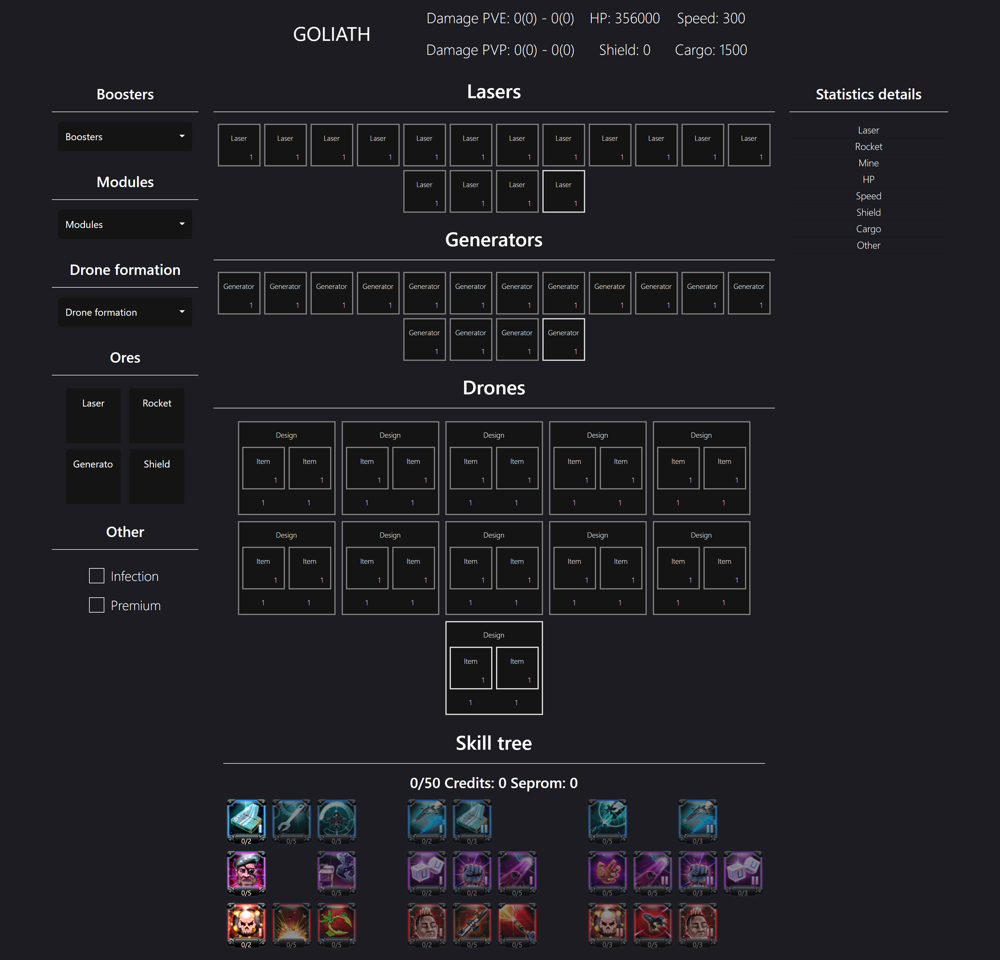
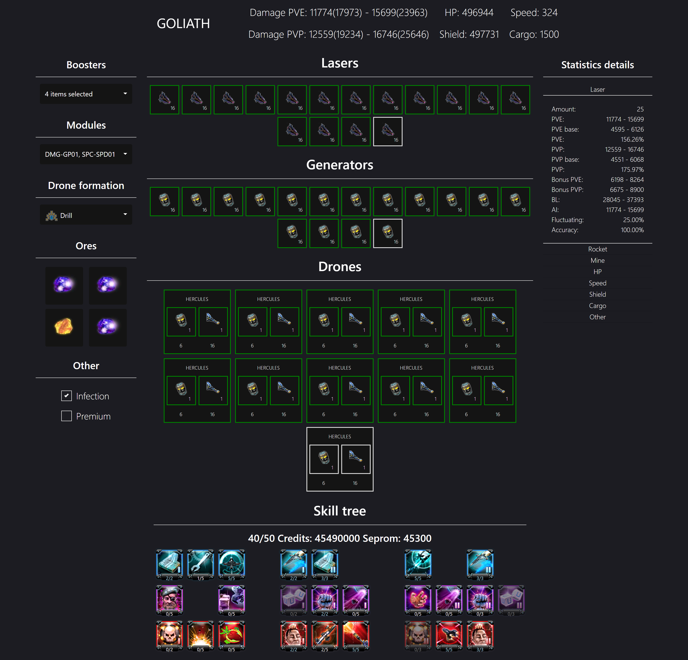

# DO calculate
> It is an application to calculate ship stats from [darkorbit](https://int1.darkorbit.com/)

## Demo
Here is a working live demo : https://gitjest.github.io/DO-calculate/

## Table of contents
* [Screenshots](#screenshots)
* [Technologies](#technologies)
* [Setup](#setup)
* [To-do](#To-do)

## Screenshots



## Technologies
* Bootstrap - 4.1.1
* JQuery - 2.1.1

## Setup
To run this project
```
# Clone this repository
git clone https://github.com/GITjest/GITjest.github.io

# Go into the repository
cd GITjest.github.io/DO-calculate

# Run the app
start index.html
```

## To-do
* Data update to the current version of the game
* Add ammunition
* Improve damage calculation
* Add P.E.T
* Add CPU
* Creating modules
* Limiting the maximum upgrade level for some items to 16